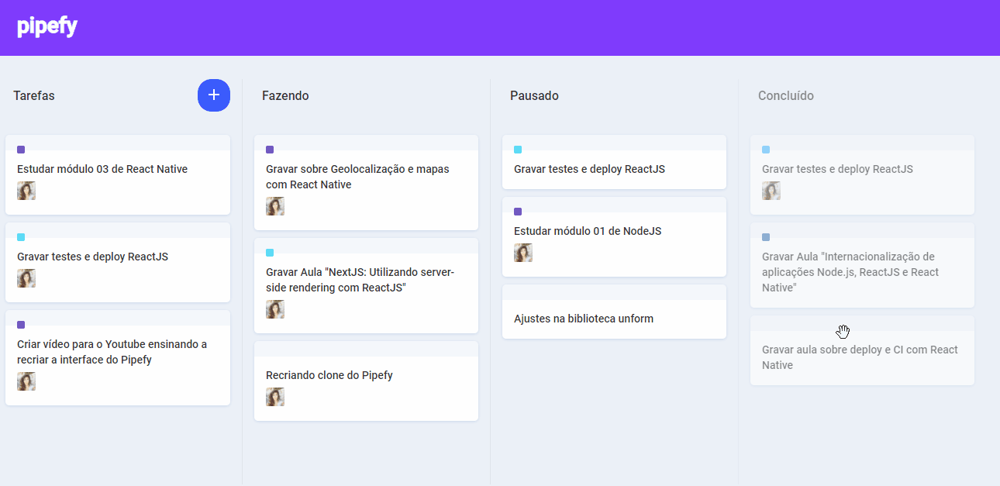

<h1>
  
</h1>

<br />

<h2 align="center">Projeto</h2>
<p>
Projeto criado durante o <strong>UI Clone</strong> da <a href="" style="color: #7f3bfd">Rocketseat</a> no YouTube. Criamos a interface do Pipefy utilizando Reactjs e algumas bibliotecas para mexer com o conceito de state do react e para criar a função de drag n' drop.
</p>

<br />

<h2 align="center">Tecnologias</h2>
<ul>
  <li>JavaScript</li>
  <li>React.js</li>
</ul>

<br />

<h2 align="center">Objetivo:</h2>
<p>
  Praticar conceitos de Reactjs e libs.  
</p>
<ul>
  <li>Hooks <i>(useState, useContext, useRef, etc)</i></li>
  <li>Immer <i>(para poder alterar useState como objeto ou array)</i></li>
  <li>Styled Components</li>
  <li>Lib react-dnd <i>(para utilizar hooks integrados e fazer drag n' drop)</i></li>
  <li>Lib react-dnd-html-backend</li>
</ul>

<br />

<h2 align="center">Como utilizar:</h2>
<p> Você precisa ter instalado na sua máquina o <a href="https://nodejs.org/en/">Node.js</a> para poder rodar o projeto.</p>
   
<p align="center">
  <strong>Passos:</strong>
</p>

<p>1. Clone o repositório.</p>

```
  $ git clone https://github.com/viictorcamposs/Clone-pipefy-interface
```
<p>2. Abra o projeto no editor de sua preferência.</p>

<p>3. No seu terminal, instale os pacotes necessários.</p>

Yarn
```
  $ yarn
```
ou
```
  $ npm install
```

<p>5. Show de bola! Agora inicie o servidor.</p>

```
  $ yarn start
```
ou
```
  $ npm run start
```
<p>6. Abra seu navegador. O projeto vai estar disponível em <a href="http://localhost:3000">http://localhost:3000/</a></p>